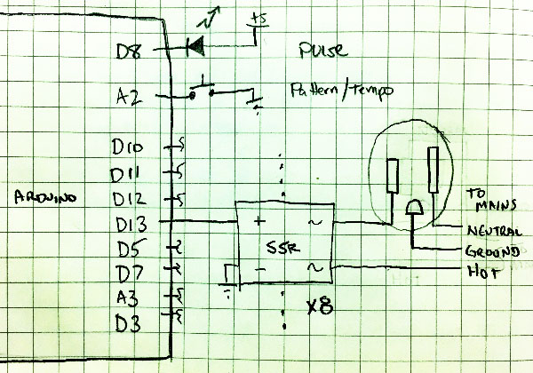

# ARLENE

Arduino-Relay Light Engine (Nee Engine)

This is a simple engine to sequence the playback of bits on a series 
of digital outputs.  Ostensibly, those outputs are connected to 
solid state relays, switching AC-Mains-level power, and have fairy
light strands connected to them.

The playback engine has one button to control it, a limitation of 
the original hardware this was constructed for; repurposed stepper 
motor controllers, with a limited number of the Arduino's bits brought
out to an accessible interface. 

The interface is - tap quickly to set and synchronize the tempo, tap-press long to change the animation pattern sequence

It also has one LED indicator which shows the tempo that is currently
being used.

Also included in this directory is a PNG with the basic schematic.

## Patterns

The included patterns are:

- Cylon (Larson) Scanner
- Two-light marquee
- Three-light marquee scroll
- Four-light marquee scroll
- Four-light marquee scroll (backwards)
- All lights flashing
- All lights off
- All lights on
- Half-Cylon Scanner
- Half-Cylon Scanner (backwards)

## Schematic

	
<!-- i hope this works, otherwise i'll look really silly... -->

