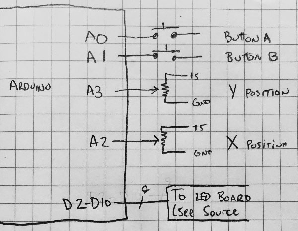

# Big LED Board

This directory contains a few projects related to our BIG LED BOARD.

These were made to be used with an Arduino Uno; ATmega 328p.  The
data line controls are written using direct port read/writes, so
this will require extensive work to get working with other ATmega
or other micros.

The projects in here are:

## BigLEDBoard_MakerFaire 

This is the source code for the "information 
about Interlock Rochester" presentation. This is by far the most advanced
of all of the projects in this directory.  

It has a local memory buffer, into which the graphics are rendered.  The 
included graphics calls 

It includes five 8px tall fonts; CapsCaps (big and small caps), ReadyP9
(based on Casio/Tandy pocket computer LCDs), NarrowCaps (mostly uppercase, 
very narrow lettering), and Onyx (art deco looking font.)  All of the fonts
were created by myself, @yorgle. 

It also has support for 16px tall precomputed graphics which can be blitted 
to the display buffer as well.

The playback engine supports slides with animations, different
time-for-display of each slide, etc.

## BigLEDBoard_EtchASketch 

Two potentiometers control the X and Y position 
of the cursor, and two buttons control this oddly shaped etch-a-sketch.

## BigLEDBoard_Tests

These are just some samples to test communications with the board and determine performance of various timing patterns and display methods.

## Schematic

	

