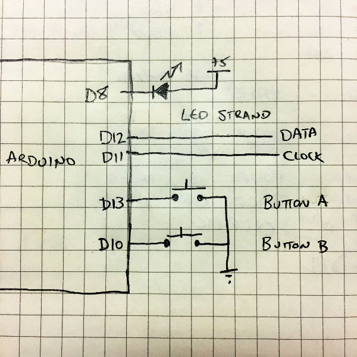

# Light Strand Engine

This is basically just a driver for patterns for the WS2801 controlled
LEDs. 

This could be adapted for use with other types of light strands.

This also was originally intended for use with ATmega 168p-based
hardware but should run fine on any Arduino.

You need to have installed the WS2801 library and the SPI library.

Also included in this directory is a PNG with the basic schematic.

The big thing about this project is that it supports an arbitrary number
of LEDs on the strand. The pattern to be displayed is "rendered" as the
data is being sent out to the LEDs... 

## Patterns

The included patterns are:

- All Off
- Red/Green Static
- Red/Green Marquee
- Red/Green/Blue/Orange/Purple static
- Multicolor blending
- Multicolor marquee
- Multicolor fading
- Arctic Twilight

## Schematic

<!-- i hope this works, otherwise i'll look really silly... -->

